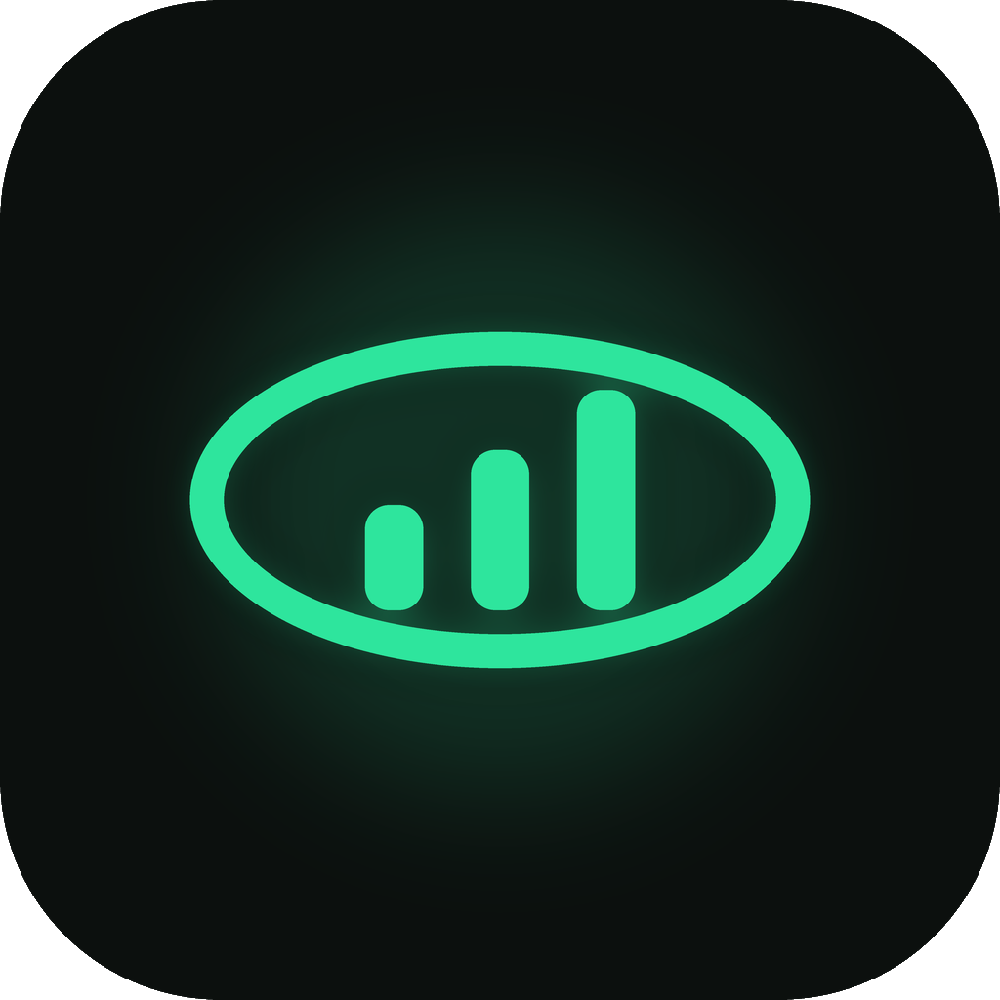

# HoldVue

極簡浮動觀盤工具（TrafficMonitor 風格）— 系統效能與股票／加密貨幣報價一鍵切換，支援 **Windows** 與 **macOS**。



## 功能

- 極簡無邊框浮動視窗（可置頂、透明度、尺寸、系統匣）
- 單擊：系統效能（上傳／下載／CPU／記憶體）↔ 股票報價
- 連點三下：安全鎖定（只顯示系統效能）；再連點三下解鎖
- 右鍵選單：主題、永遠置頂、左鍵穿透、低對比、透明度、尺寸、完整設定
- 美股盤前／盤後報價（無延長交易則退回盤中／收盤）
- 漲跌幅顯示；台股紅漲綠跌、美股／加密綠漲紅跌；低對比可關閉色塊
- 股票列寬度響應式：夠寬兩欄，變窄則單欄往下排
- Yahoo Finance + CoinGecko 報價
- Windows 極簡模式不佔工作列（僅系統匣）；macOS 維持 Dock

## 安裝（Release）

到 [Releases](https://github.com/jimmy77733/HoldVue/releases) 下載：

| 平台 | 檔案 | 說明 |
|------|------|------|
| Windows x64 | `HoldVue-Windows-x64.exe` | 原生 WebView2 單檔（內含 UI／服務／Node，無須另裝 Node） |
| macOS Apple Silicon | `HoldVue-macOS-arm64.zip` | Electron 版，解壓後執行 HoldVue |
| macOS Intel | `HoldVue-macOS-x64.zip` | Electron 版，解壓後執行 HoldVue |

> Windows 需 [WebView2 Runtime](https://developer.microsoft.com/microsoft-edge/webview2/)（Win11 通常已內建）。  
> 開發模式需 [Node.js 18+](https://nodejs.org/)。

## 開發者執行

```bash
git clone https://github.com/jimmy77733/HoldVue.git
cd HoldVue
npm install
npm run service   # 另開終端也可
npm start         # Electron 小視窗
```

僅啟動服務（用瀏覽器開 `http://127.0.0.1:18990/`）：

```bash
npm run service
```

### Windows 原生殼

```bash
cd desktop/win
powershell -NoProfile -ExecutionPolicy Bypass -File prepare-payload.ps1
dotnet publish -c Release -r win-x64 --self-contained true -p:PublishSingleFile=true -o ../../dist/win-native
```

正式 Release 由 GitHub Actions 打包並內嵌可攜式 Node。本機開發可只跑 `npm run service`，由殼層自動找專案根目錄啟動。

## 設定標的

右鍵 → **完整介面 / 設定**，或開啟 `http://127.0.0.1:18990/`。  
預設設定檔：`app/config.json`（儲存後會立刻重抓報價）。

## 專案結構

```
HoldVue/
├── app/                      # 前端 UI + 預設 config
├── assets/                   # holdvue.png / holdvue.ico
├── services/core.js          # HTTP :18990 + 報價更新
├── electron/                 # Electron 殼（Win / Mac）
├── desktop/win/              # Windows WebView2 原生殼（Release 主推）
├── scripts/make_icon.py      # 重繪圖示（可選）
└── .github/workflows/        # Release CI
```

## 授權

MIT © jimmy77733
